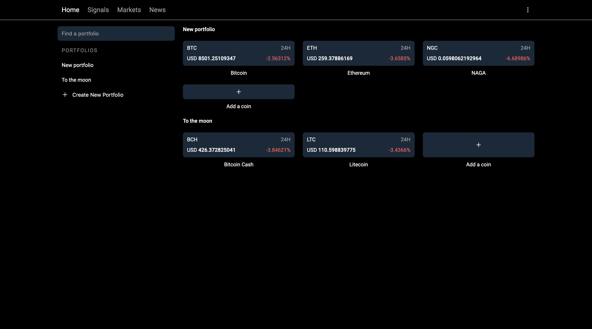

# [Cryptocurrency portfolio](http://price.surge.sh)

[](https://github.com/prettier/prettier)
[](https://github.com/malcodeman/crypto-portfolio/blob/master/LICENSE)

Bitcoin & cryptocurrency portfolio tracker.



## Getting started

First, clone and run the api:

```
git clone https://github.com/malcodeman/cmc-api-wrapper.git cmc-api-wrapper
cd cmc-api-wrapper
yarn install
yarn start
```

Next, you can clone and run the frontend:

```
git clone https://github.com/malcodeman/crypto-portfolio.git crypto-portfolio
cd crypto-portfolio
yarn install
yarn start
```

.env.development.local:

```
REACT_APP_API_URL = "http://localhost:4000/api"
```

.env.production.local:

```
REACT_APP_API_URL = "https://malcodeman-cmc-api-wrapper.glitch.me/api"
```

## Todos

- Passcode
- Languages
- Signals
- Settings
- News
- Portfolios drag & drop
- Add a coin pagination
- Show balance toggle
- Search portfolios

## License

[MIT](./LICENSE)
